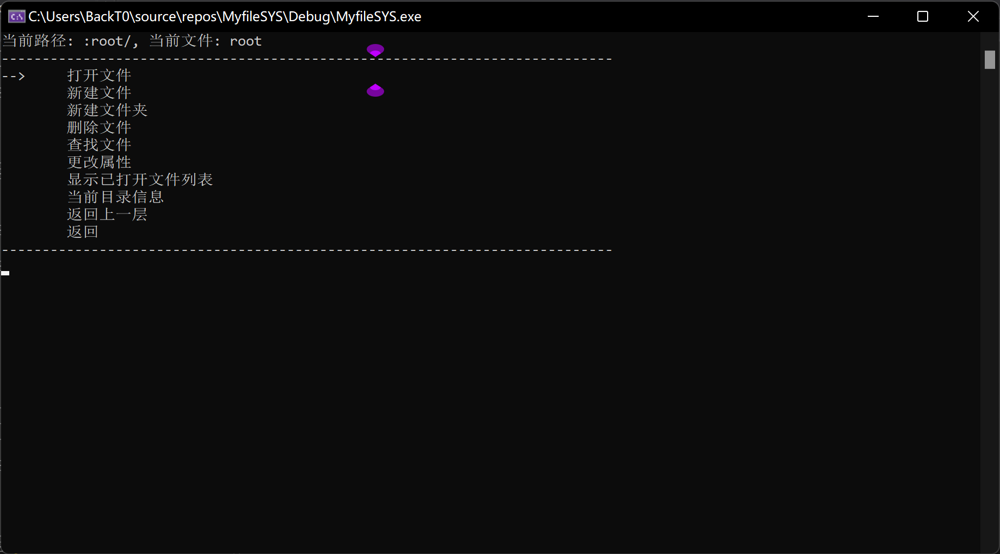
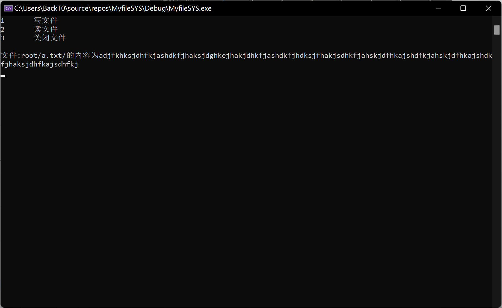
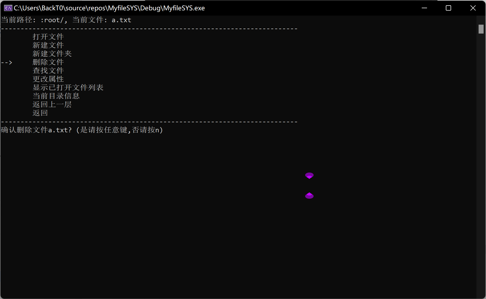

simulateDiskFileSystem
# 一、需求分析

##  1.课程设计目的

了解磁盘文件系统的结构、功能和实现，设计一个简单的文件系统，用文件模拟磁盘，用数组模拟缓冲区。

##  2.现有系统环境

###  (1)硬件环境

处理器：AMDRyzen5

内存：16.0GB

硬盘空间：512GB

###  (2)软件环境

操作系统：windows11

IDE：VisualStudio2019

语言：C++

##  3.输入的形式和输入值的范围

输入形式：操作界面输入\'w\'进行上移选项，输入s进行下移选项，输入\'a\'进行返回操作，输入\'d\'进行打开操作，输入回车进入相应的选项，输入其他刷新界面。

输入值的范围：新建文件的文件名不超过五个字节（检测超过将提示）。

##  4.输出的形式

图形化显示。

##  5.程序达到的功能

###  (1)基本功能

支持多级目录结构，支持文件的绝对读路径；

文件的逻辑结构采用流式结构，物理结构采用链接结构中的显式链接方式；

采用文件分配表FAT

实现的命令包括建立目录、列目录、删除空目录、建立文件、删除文件、显示文件内容、打开文件、读文件、写文件、关闭文件、改变文件属性。可以采用命令行界面执行这些命令，也可以采用"右击快捷菜单选择"方式执行命令。

最后编写主函数对所作工作进行测试。

###  (2)附加功能

支持子目录可以任意长（磁盘有可分配磁盘块）

文件内容可以任意长（磁盘有可分配磁盘块）

支持非空文件夹的递归删除

支持全局搜索文件

支持文件自动保存

支持绝对路径

支持读取二进制磁盘文件

支持多级树形目录显示

支持通过已打开文件列表进行读写操作

# 二、概要设计

##  1.总体开发的思想

###  (1)主要的数据结构

分析课程设计的内容，为了实现第一条支持多级目录结构，使用多叉树结构。

每一个文件夹点可以有多个子文件，考虑到子文件可以是文件夹，所以将文件和文件夹都抽象为文件。

为了实现文件的逻辑流式结构，使用数组来存储相应文件内容。

为了实现文件的物理结构，使用链表数据结构。

###  (2)数据的存储方式

为了模拟磁盘文件系统，要体现文件的组织结构和磁盘空间的管理，需要将数据以块的方式写入"磁盘"，在"磁盘"和系统之间使用buffer数组模拟高速缓存，每次写入磁盘都要通过高速缓冲写入。

###  (3)使用的语言

使用C++语言。

##  2.系统模块结构图d

###  ↓顶层流程图↓

###  ↓文件管理系统功能图↓

###  ↓磁盘管理系统功能图↓

# 三、详细设计

##  1.模块设计

###  (1)文件实体myFile：

无论是文件管理系统还是磁盘管理系统，都依赖与文件实体的存在，对于文件实体，它必须提供以下必须的基本功能：

a.能够存储文件名、文件属性、文件内容三大基本信息

b.能够体现目录结构

c.能够指向在它磁盘中的物理存储位置

基于这三点，myFile的数据类型设计如下：

对于a，有 stringname;//文件名

charpropertie;//文件属性

stringtext;//文件内容

对于b，有 booliscatalog=false;//是否文件夹

Myfile\*parentcatalog=nullptr;//父目录

intlevel=0;//目录层级

vector\<Myfile\*\>fileList;//如果是文件夹则有文件列表

对于c，有 DISK\*disk=nullptr;//所属磁盘

vector\<int\>blockList;//盘块列表

###  (2)磁盘管理系统DISK：

磁盘管理系统是与存取文件有关的系统，文件的存储和删除必须经过磁盘管理系统，三层可以通过"访管指令"调用磁盘管理系统的功能模块。为了进一步模拟磁盘管理系统，磁盘管理系统的所有操作都通过buffer进行读写，buffer是磁盘的缓冲区，每次写入或读出的数据量都是buffer块大小。在本次课设中，buffer为64字节，也就是一个磁盘块的大小。

另一方面，文件有记录结构，磁盘管理系统拥有这个记录，也就是FAT表。根据指导书上的说明，FAT结构说明如下：

a.磁盘有多少块，文件分配表就有多少项，若某文件的一个磁盘块号为i，则这个文件的下一个磁盘块号应该记录在文件分配表的第i项。

b.假设模拟磁盘有128个物理块，每个物理块大小为64字节。盘块的块号从0编起。

c.因为b，文件分配表有128项，每项占用一个字节，所以文件分配表占用了磁盘的0块和1块，这两块不能作其它用处。

d.FAT值为0表示盘块空闲，-1表示文件结束，254表示盘块损坏，其他表示盘块占用。

所以磁盘管理系统DISK的数据类型设计如下：

charFAT\[BLOCKCOUNT\];//FAT

charbuffer1\[BLOCKSIZE\]={0};//缓冲1

charbuffer2\[BLOCKSIZE\]={0};//缓冲2

intblockNumber1;//当前buffer1所缓存的磁盘盘块号

intblockNumber2;//当前buffer2所缓存的磁盘盘块号

FILE\*fp;//模拟的磁盘

###  (3)文件管理系统UI：

文件管理系统UI要模拟文件管理系统的功能。该系统能够对所有的文件进行管理，所以他要保存所有文件的信息以方便呈现给用户。另外该系统还能向用户提供对文件的操作。为了方便地进行文件操作，文件管理系统UI留有磁盘信息，根目录信息，能保存用户当前指向的文件等。

所以文件管理系统UI的数据类型设计如下：

DISK\*disk;//磁盘

Myfile\*root;//根目录

Myfile\*currentCatalog;//当前文件夹

Myfile\*currentFile;//当前文件

intcurrentOFTL=1;//当前打开文件列表指针

vector\<OFTILE\*\>openfile;//文件打开列表

vector\<Myfile\*\>allfile;//存储所有的文件

vector\<string\>fileOperate=

{\"打开文件\",\"新建文件\",\"新建文件夹\",\"删除文件\",\"查找文件\",\"更改属性\",\"显示已打开文件列表\",\"当前目录信息\",\"返回上一层\",\"返回\"};

###  (4)工具模块DiskUtil：

因为读取磁盘功能子程序粒度比较大，所以将它单独拉出来作为一个模块。该模块能够读取磁盘，通过FAT表形成文件实体，再将实体返回给文件管理系统。

工具模块的数据类型设计如下：

DISK\* disk1; //记录磁盘

Myfile\* root1; //记录根目录

Myfile\* current; //记录当前生成的文件

##  2.主要操作函数

###  (1)文件实体myFile

对于文件实体，它向文件管理系统提供文件信息，向磁盘写入文件内容。主要有以下几类函数：

a.数据封装函数，这里主要是对myFile类的属性进行封装。

b.对文件的简单操作，比如查找文件，增加子文件，删除文件等。

c.对磁盘的操作，这里只有对磁盘的读和写操作。

所以文件实体的函数如下：

//数据封装

voidsetName(stringname);

voidsetText(stringtext);

voidsetPropertie(charpropertie);

boolisCatalog();

stringgetName();

Myfile\*getChildren(intindex);

Myfile\*getParent();

intgetBlockCount();

intgetStartDex();

vector\<int\>getBlockList();

chargetPropertie();

stringgetText();

intgetSize();

stringgetPath();

intgetLevel();

DISK\*getDisk();

vector\<Myfile\*\>getChildrens();

intgetChildrenCount();

//文件操作

Myfile\*searchFile(stringfileName,booliscatalog);

Myfile\*search(stringfileName,booliscatalog);

booladdFile(Myfile\*file);

voiddelectFile();

voiddeleteChildren(Myfile\*children);

voidchangePath(Myfile\*parent);

//磁盘操作

voidwriteFileToDisk();

###  (2)文件管理系统UI

对于文件管理系统UI，它管理这所有的文件，并将文件的管理操作呈现给用户。主要有以下两类函数：

a.呈现给用户的显示函数

b.管理文件的操作函数

所以文件管理系统UI的函数如下：

//呈现给用户的显示函数

void run();//运行主界面

void showFAT();//显示FAT

void fileList();//文件列表

void showFileList(int dex);//显示文件列表

void filelistOperate();//文件列表操作

void showFileListOperate(int dex);//显示文件操作列表

void OFTL();//文件打开列表

void showOFTL(int dex);//显示文件打开列表

showOFTLoperate(int dex);//显示文件打开列表操作

void treeLst();//树形目录选择

void showTreeLst(int dex);//显示树形目录

//管理文件的操作函数

void openFile(int& row);//打开文件

void newFile();//新建文件

void newCatalog();//新建文件夹

void deleteFile();//删除文件

void searchFile();//查找文件

void changeFile();//更改属性

void backLevel(int& row);//返回上一层

void getAllFile(Myfile\* root);//获取所有的文件到allfile中

void addOFTILE(Myfile\*);//添加文件到打开列表中

void deleteOFTILE(Myfile\*);//把文件从打开列表项中移除

###  (3)磁盘管理系统DISK

对于磁盘管理系统DISK，它主要通过FAT表，向文件提供对磁盘的写入和读取功能(通过buffer)。主要有以下三类函数：

a.对FAT表操作

b.对磁盘读写操作

c.buffer操作(私有)

所以磁盘管理系统DISK的函数如下：

//对FAT操作

void change_FAT(int dex, int next);

int get_FAT(int dex);

int get_free_Disk_block();

int get_free_Disk_block(int dex);

void updata_FAT_to_Disk();

//磁盘读写操作

std::string read_Block(int dex);

void write_Block(int dex, char content\[64\]);

void initDisk();

void saveDisk();

void closeDISK();

//使用buffer对磁盘进行读写操作

void load_Disk_block_into_buffer1(int dex);

void load_Disk_block_into_buffer2(int dex);

void write_buffer1_into_Disk(int dex);

void write_buffer2_into_Disk(int dex);

###  (4)工具模块DiskUtil

对于工具模块，它是辅助以上三个系统的模块，能够读取磁盘系统，通过FAT表形成文件实体，再将实体返回给文件管理系统。

工具模块DiskUtil的函数如下：

Myfile\* loadDisk(); //读取磁盘，生成文件实体，返回生成的文件实体根目录

void creatFile(char a\[8\]); //创建文件实体

void traverseDirEntries(int dex); //遍历目录项

void loadCatalog(Myfile\* file); //加载目录

##  3.界面设计

###  (1)↓主界面↓

{width="5.768055555555556in"
height="3.2006944444444443in"}

###  (2)↓文件操作界面↓

{width="5.768055555555556in"
height="3.2006944444444443in"}

###  (3)↓已打开文件列表界面↓

{width="5.768055555555556in"
height="3.2006944444444443in"}

###  (4)↓当前目录信息界面↓

{width="5.768055555555556in"
height="3.2006944444444443in"}

##  4.底层实现

在指导书上详细写了关于文件操作的实现方法，这里展示一些指导书之外的、比较复杂的核心算法的实现

###  (1)void Myfile::writeFileToDisk()

这是文件实体中把文件写回磁盘的函数，主要实现将文件写回磁盘的功能。

根据指导书上的指导，文件的目录项包括：文件名(3字节)、文件类型(2字节)、文件属性(1字节)、文件的起始盘块号(1字节)、文件的长度(1字节)，每个目录项占用
8 个字节，一个盘块能放 8 个目录项。

其中文件属性(1字节)中的位有相应的意义，为 1 表示是，为 0
表示否，第零位表示只读文件，第一位表示系统文件，第二位表示普通文件，第三位表示目录属性，其他未使用。

该函数流程图如下：

###  (2)void UI::deleteFile()

这是文件管理系统中删除文件的操作，主要实现将文件删除。值得注意的是，文件的删除在整个系统中不是简单的删除文件实体就行了，还有涉及以下问题：

a.如果文件已经打开过，要在文件打开列表中将该文件移除

b.文件处于某个目录下，要将目录保存的子文件信息删除，包括磁盘中的该文件的目录项也要置为\$

c.如果删除目录，要将子文件递归删除

d.如果是文件，且有内容，要将内容从磁盘中删除，FAT表也要相应更改

e.如果文件所在的目录占据的磁盘块不止一块(也就是说文件数量大于8，因为一个盘块只能放8个目录项)，而且在删除这个文件后刚好可以空出一块磁盘块，那么这个磁盘块要释放掉。

要处理这些事务，将会使得函数的粒度变得很大，所以将删除任务分解成以下三部分执行：

a.文件管理系统UI负责关闭相应的文件打开列表、从父目录中删除该文件的信息

b.文件实体负责将自己在磁盘中保存的文件内容的磁盘块清空、并且删除相应的目录项

c.磁盘管理系统负责对相应的盘块进行擦除

该函数流程图如下：

###  (3)工具模块DiskUtil

这是一个读取磁盘系统，通过FAT表形成文件实体，再将实体返回给文件管理系统的工具模块。

该模块流程图如下：

# 四、调试分析

##  1.设计过程遇到的问题及解决方案

a.一开始的设计是写一个树形目录结构的文件类，直接显示文件结构，然后再通过文件类写入磁盘。但是实现以后不能体现磁盘的读写操作和块操作，所以还要增加一个磁盘类。

b.设计磁盘类的时候考虑FAT表是放在磁盘类中还是文件类中，如果放在磁盘类中，那么FAT的管理也需要放在磁盘类中统一管理，这样无疑会增加磁盘类的复杂度。解决办法是添加磁盘类的设置方法，将FAT的修改权限交给文件，如果文件要获取空闲磁盘块，则在FAT中查找。磁盘类只负责磁盘的写入和读出。

c.如何将文件系统显示给用户是一个很大的问题，如果按照指导书上的做法，只能显示当前文件，并且更换文件都要执行一次文件操作选项，十分麻烦。我将其改进如下：扫描磁盘所有文件，将所有文件的指针保存下来，同时将文件名按照树形目录展示给用户，用户可以使用菜单选择文件，系统根据相应的文件指针对文件进行操作。

##  2.算法时间复杂度

磁盘扫描算法的时间复杂度是log(n), 其余函数不涉及算法。

##  3.经验和体会

a.课程设计的开始要想好思路，做好需求分析，画出顶层数据流图，使用自顶向下的方法能快速准确地构造系统模型。

b.在设计磁盘的时候，要充分考虑到实际磁盘的读取方式，要体现FAT表发挥的重要作用。

c.使用C++语言，如果遇到奇奇怪怪的bug，优先排查内存问题，很多时候都是内存移除或者越界造成的。

d.有些基本的操作是会重复用到的，在设计这些基本操作的时候要考虑到不同的使用场景，考虑稳定性。

##  4.实现过程遇到的问题及解决方案

a.把文件保存到磁盘的时候没有保存成功，也没有错误提示。经过排查，C++中打开文件流时，如果向文件写入了内容，如果没有关闭文件，内容是不会即时保存的，解决办法是添加一个函数，作用是将磁盘文件关闭，再以\"r+\"方式打开，达到保存的目的，当要保存文件时这个操作。

b.查找文件时，victor数组越界。经过排查，查找文件时会遍历父目录的孩子，如果当前是根目录的话，其父目录为空，访问一个空指针的对象的属性自然出错。解决办法是遍历前判断对象是否为空。

c.写入文件时，文件所在目录的其他目录项没有了。经过排查，写入文件时要同时写入相应的文件目录项，关键在于磁盘写入文件是以块写入的，文件目录项只占了块的八分之一，写入的时候又按块写入，自然其他目录项被覆盖掉了。解决办法是计算目录项所在的位置，越过磁盘操作，直接写入目录项。

d.删除文件夹时，victor数组越界。经过排查，问题出现在进行递归删除文件时，期间进行了\'将自己从父目录的孩子列表中删除的操作\'，擦除之后递归中victor的迭代器指针还是原来的指针，所以删除到最后一个文件的时候会出现数组越界。解决办法是把\'将自己从父目录的孩子列表中删除的操作\'在递归中的顺序进行调整，调整为在递归操作之后执行。

e.重复打开一个文件时，文件打开列表出现多个同一文件。解决办法是在新增文件打开列表的时候删除旧的项，新增新的项。

f.从磁盘读取出文件时，FAT表没有读取。重新打开工程文件后解决，不知道什么问题，猜测可能是IDE的bug。

g.从磁盘读出文件时，只读取了根目录。经过排查，递归出现逻辑错误。解决办法是重写递归函数。

h.从磁盘读取出的文件属性错误，文件显示成文件夹。经过排查，写入磁盘的时候属性那一个字节中，标记是否文件夹的位写入了1。解决办法是创建文件的时候，如果是文件夹，属性那一字节直接设为0b00001100，如果是文件则设为0b00000100。

# 五、用户使用说明

##  1.界面操作

操作界面输入\'w\'进行上移选项，输入s进行下移选项，输入\'a\'进行返回操作，输入\'d\'进行打开操作，输入回车进入相应的选项，输入其他刷新界面。

需要注意的是，如果要在某个文件夹里面新建文件，首先要选中文件夹内的文件，再进行新建文件操作，如果该文件夹内没有文件，则请先打开文件夹，再新建文件，否则新建的文件是在选中的文件夹外面的。

对文件操作需要选中文件才能操作，在操作界面最上方有显示当前文件，如未选中则无法进行文件操作。

##  2.其他操作

按照界面文字提示进行相应的输入。

# 六、测试与运行结果

1.新建文件a.txt、b.txt、c.c、d（测试新建文件功能。可以看到新建的文件都分配了磁盘块）

{width="5.768055555555556in"
height="3.2006944444444443in"}

2.新建文件夹lv1、lv1_2、lv1_3（测试新建文件夹功能。可以看到，新建的文件夹都分配了磁盘块。值得注意的是，root目录也另外分配了磁盘块，那是因为设定了目录将满的时候预分配磁盘块）

{width="5.768055555555556in"
height="3.2006944444444443in"}

3.在文件夹lv1_2中新建文件1、2、3、4，然后返回主界面（测试多级树形目录功能。可以看到界面是树形目录显示的）

{width="5.768055555555556in"
height="3.2006944444444443in"}

4.查看当前打开目录（测试支持绝对路径功能。可以看到，显示的路径是当前的绝对路径）

{width="5.768055555555556in"
height="3.2006944444444443in"}

5.在文件夹lv1_3中新建文件a、b、c、d、e、f、g、h、i，然后返回主界面，观察FAT表（测试子目录可以任意长功能可以看到，lv1_3中的
子文件有9个，而且盘块也分配了两9和22，在FAT中可以看到FAT\[9\] =
22，FAT\[22\] = -1）

{width="5.768055555555556in"
height="3.546527777777778in"}

6.打开根目录文件a.txt，写入超过64字节的文件，然后返回主界面，观察FAT表（测试文件内容任意长功能。可以看到，文件a.txt分配了两个磁盘块，分别是3和25，在FAT表中有所显示）

{width="5.768055555555556in"
height="3.546527777777778in"}

{width="5.768055555555556in"
height="3.546527777777778in"}

7.打开文件夹lv2文件1，不进行写入操作。（测试文件只读方式）

{width="5.768055555555556in"
height="3.546527777777778in"}

8.打开文件打开列表，查看文件打开列表选项（测试文件打开列表。刚刚文件a.txt是以读写方式打开的，所以文件a.txt的写指针是指向写指针末尾，也就是盘块25的第50个字节；而文件1是以只读方式打开的，所以文件1的写指针和读指针都在文件头）

{width="5.768055555555556in"
height="3.546527777777778in"}
9.文件打开列表中，对文件a.txt进行读操作，对文件1进行写操作（测试文件打开列表中的读写指针）

{width="5.768055555555556in"
height="3.546527777777778in"}

{width="5.768055555555556in"
height="3.546527777777778in"}

10.返回主界面，删除根目录的a.txt文件，然后打开已打开文件列表，接着返回主界面，观察FAT表（测试文件删除功能，删除文件前关闭已打开文件列表。可以看到随着文件删除，如果文件已打开，那么文件在已打开文件列表上也会删除；另外，文件a.txt之前是占用了盘块3和盘块25，观察FAT表中相应的盘块也已经释放）

{width="5.768055555555556in"
height="3.546527777777778in"}

{width="5.768055555555556in"
height="3.546527777777778in"}

{width="5.768055555555556in"
height="3.546527777777778in"}
11.删除文件夹lv3，然后返回主界面，观察FAT表（测试非空文件夹递归删除功能。可以看到，子文件已经全部删除，而且子文件所长的盘块也已经释放）

{width="5.768055555555556in"
height="3.2006944444444443in"}

{width="5.768055555555556in"
height="3.2006944444444443in"}

12.用全局搜索查找lv2中的文件4（测试文件查找功能）

{width="5.768055555555556in"
height="3.2006944444444443in"}

{width="5.768055555555556in"
height="3.2006944444444443in"}

13.返回主界面，然后直接关闭程序（测试文件自动保存功能）

14.重新运行程序，输入y读取磁盘文件，进入主界面（测试从磁盘读出二进制数据、形成文件功能）

{width="5.768055555555556in"
height="3.2006944444444443in"}

{width="5.768055555555556in"
height="3.2006944444444443in"}

# 七、总结

这次课程设计在九月底放暑假的时候开始写的，花了差不多一个星期的时间写好了第一版，第一版是用qt写了一个前端，直接用了qt里面有的QAbstractItemModel类直接实现了要求。到了下学期末的时候，仔细看了下指导书，发现自己写的和指导书上车初衷目的已经完全背离了，没有体现出模拟磁盘文件管理的特征。于是根据指导书上的重写了课设，并且对于磁盘文件管理系统的操作流程都按照指导书上的进行模拟，界面也采用了原始的命令行界面。

对于本次课程设计，总结以下几点体会和心得：

1.FAT就好比一个指示灯，它不对引导区、文件目录表的信息进行表示，也不真正存储文件内容，只是单纯用来表示磁盘文件的空间分配信息，但是它对文件管理却十分重要。

2\.
FAT可以确保快速访问文件，因为在计算机外存的访问速度要远远慢于内存，如果直接在外存中逐个读取查找的话花费的时间十分漫长。

3.亲手实现一个文件管理系统需要考虑到很多方面的东西，比如删除操作，要考虑到磁盘的内容，考虑到文件的多级目录，考虑到文件打开列表...等等，都是值得我去深入考虑的。

4.在开始编码之前，一定要看清楚要求，比如这次课设，一开始的时候没有仔细看指导书，导致后面的返工重做。

5.磁盘管理系统好比后端，文件管理系统好比前端，后端一定要保证逻辑思维正确，考虑周全，而前端要将文件的管理操作呈现给用户，能让用户忽略底层的磁盘读写操作。
